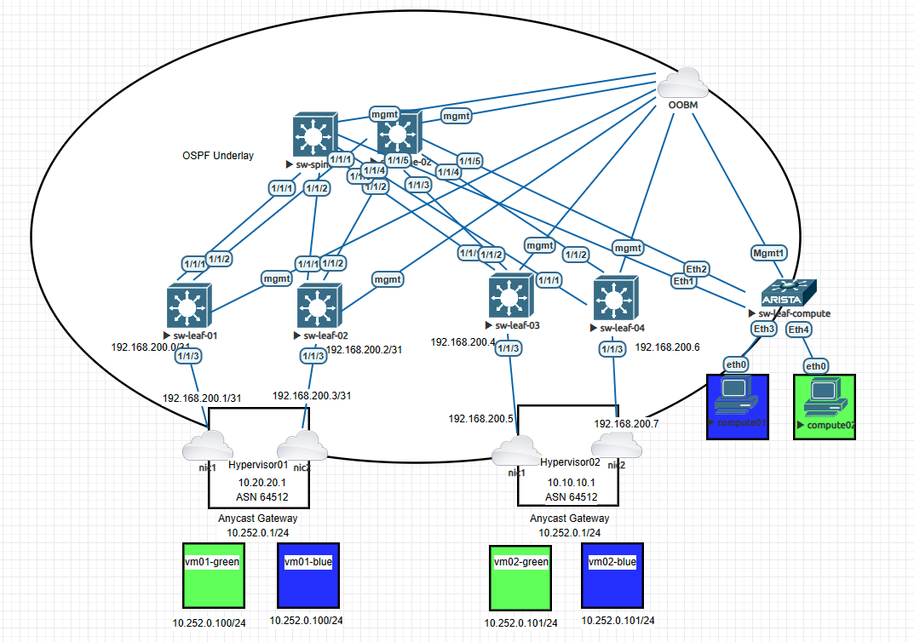

# EVPN-CSM-PoC
Proof of Concept network to be used with Cray System Managment (CSM)

## Lab Setup

- Network topology running in EVE-NG
- Hypervisors 
  - Running on VMWware Workstation
  - Ubuntu 22.04
  - kvm 6.2.0
  - FRR 8.1
- Virtual Machines 
  - Ubuntu 22.04
  - dhcpd
- Vritual Switches
  - ArubaOS-CX Virtual.10.09.0002 for spine and leaf
  - Arista EOS-4.24.10M for leaf-compute.  Aruba does not allow for L3 VNIs on there Virtual switches.  Otherwise this would have beeen an Aruba switch.

## Overview

- OSPF underlay
- VRFs
  - green & blue VRFs used to fully seperate traffic and routing instances.
- BGP overlay
  - iBGP peering between Hypervisors
  - eBGP peering between leaf-compute and Hypvervisors
  - EVPN Asymetric Distributed Anycast Gateway on Hypervisors
  - EVPN Symmetric routing between sw-leaf-compute and hypervisors
- Hypervisors serving DHCP to computes attached to sw-leaf-compute

## Topology
